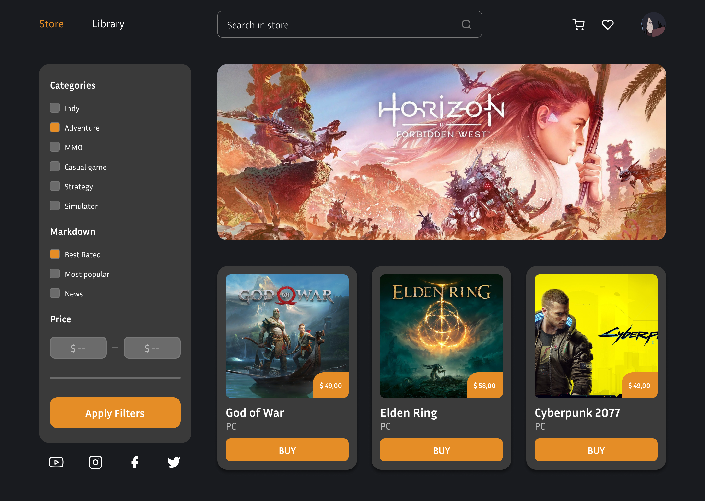
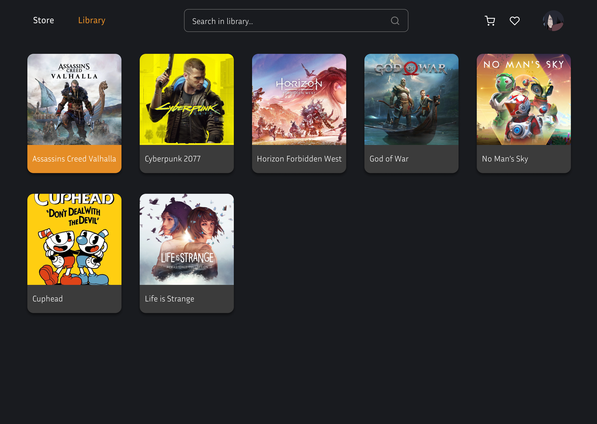
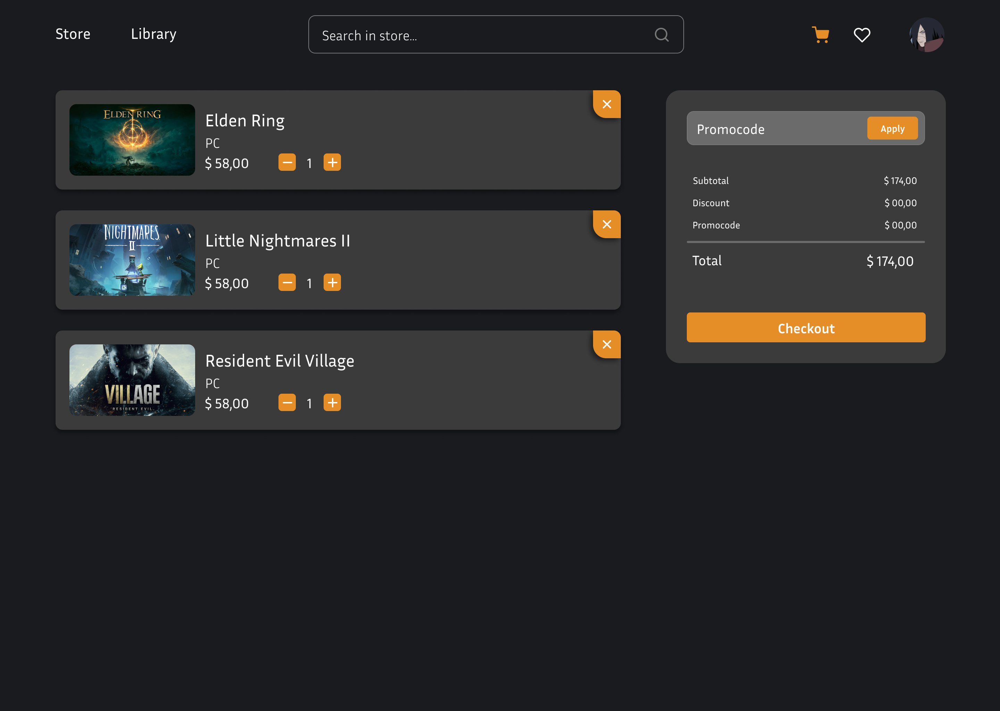

  <h1> Programação Web II :computer: </h1>
  <h6> Repositório de Programação para Dispositivos Móveis Usando Tecnologia Web </h6>

 

 

  <h3>Preview da Loja</h3>
  
  
  

 

 

  Design inspirado em: <a href='https://dribbble.com/shots/18271611-Game-Store-Website-animation'>Game Store Website animation, por Alexander Kontsevoy</a>

